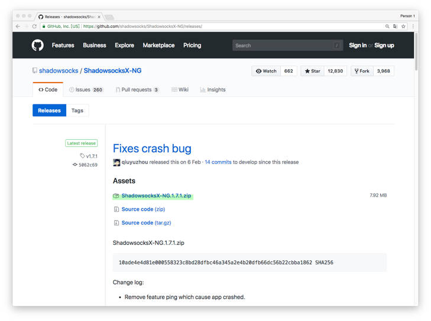
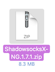
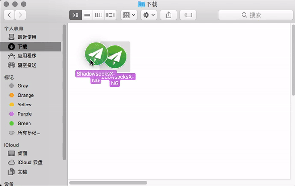
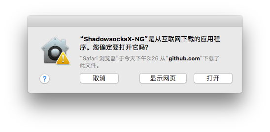
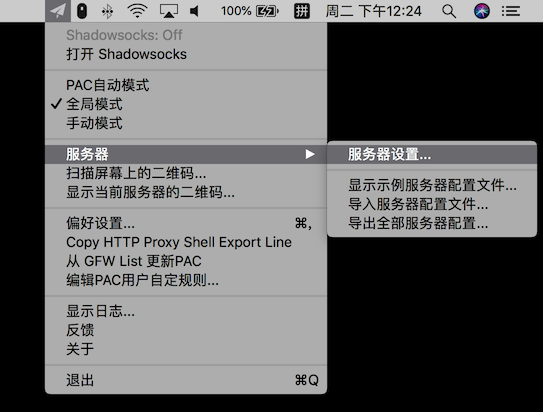
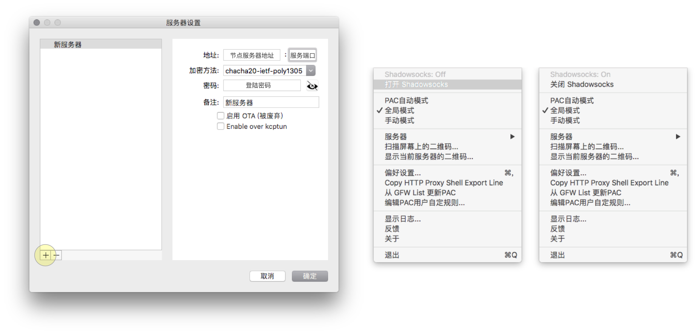
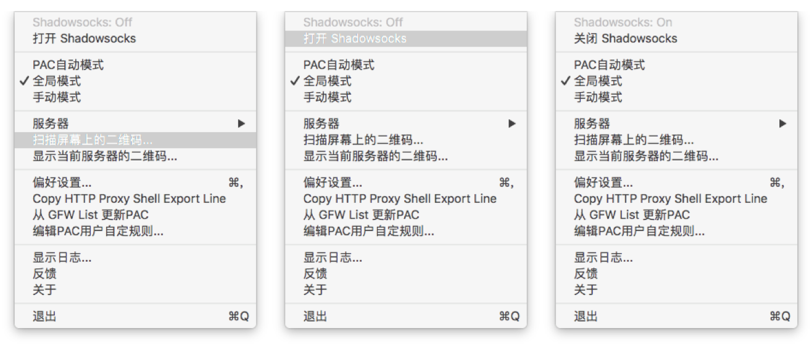
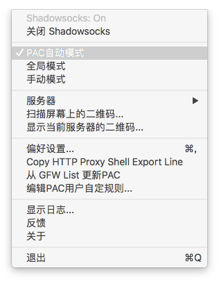

# Shadowsocks 设置方法 (macOS)

## 系统要求
**在安装之前，请始终确保您的系统满足最低系统要求。**

您需要具备 MacOS 10.11 或更高版本才能运行 ShadowsocksX-NG。如果您的操作系统版本较旧， 则请先升级到 MacOS 10.11 或更高版本。

## 安装 ShadowsocksX-NG
按照下面的说明在 MacOS 上下载并安装 ShadowsocksX-NG。

#### 1. 下载客户端

访问 Shadowsocks [下载页面](https://github.com/shadowsocks/ShadowsocksX-NG/releases/)。
点击最新版本的 `ShadowsocksX-NG.x.x.x.zip` 进行下载 (`x.x.x`为版本号) 。

或是前往 [客户端中心](https://shadowsocks.org/en/download/clients.html) 下载

#### 2. 安装客户端

双击解压 `ShadowsocksX-NG.x.x.x.zip` , 获取 `ShadowsocksX-NG`。

将 "ShadowsocksX-NG" 拖移到 “访达”里面的 “应用程序”。

在 "应用程序" 中双击 "ShadowsocksX-NG" > 选择 "打开"。

## 配置 Shadowsocks 账号

#### 在您的电脑上， 执行下列操作：

* 点击屏幕顶部菜单栏的 > "服务器" > "服务器设置"。

* 点击窗口上的 "+" > 填写 "地址" > 填写 “服务端口" > 选择 ”加密方法"。
* 填写 "密码“ > 填写"备注" 为可选项。
* 点击 "打开Shadowsocks" 。
* 当显示 `Shadowsocks: On`时，表示系统代理已经打开。

#### 可以通过二维码方式单独增加节点， 在您的电脑上， 执行下列操作：

此二维码同样适用于其他客户端。

* 点击屏幕顶部菜单栏的  > "扫描屏幕上的二维码" > 当看到 "已添加新的Shadowsocks服务器"，代表添加成功。
* 点击 "打开Shadowsocks" 。
* 当显示 `Shadowsocks: On`时，表示系统代理已经打开。

## 配置系统代理模式
*  点击屏幕右上方菜单栏的   > "PAC自动模式"。

## 注意事项
* **PAC 模式** 表示可以实现自动代理， 及本来可以访问的网站不会经过代理，推荐日常使用。
* **全局模式** 表示计算机内大多数流量都会经过代理， 不推荐日常使用。

## 	配置 Firefox 的代理

**如需使用 Firefox 浏览器	通过代理浏览网页，请参考下面链接：**  
[Firefox上设置代理](7-1-firefox-setup-guide-cn.md)

## 配置 Chrome 的代理

**如需使用 Chrome 浏览器通过代理浏览网页，请参考下面链接：**  
[Chrome + Proxy SwitchyOmega 设置](7-2-chrome-setup-guide-cn.md)
